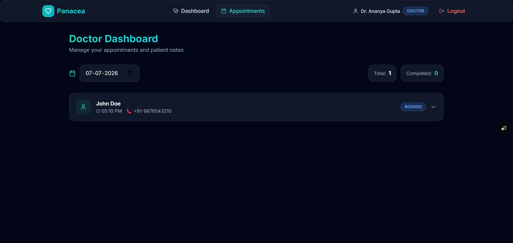
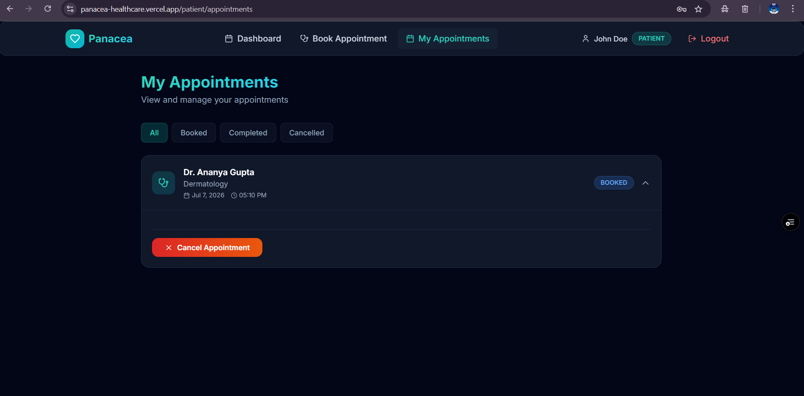
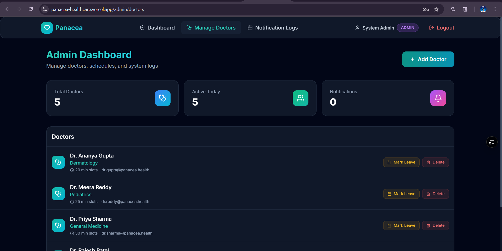

# Panacea Healthcare — Appointment & Follow-up Manager

### Link: https://panacea-healthcare.vercel.app/

A multi-role (Patient / Doctor / Admin) platform for booking appointments, capturing pre-visit symptoms, generating AI summaries, and keeping everyone notified via email and Google Calendar .

## 📸 Screenshots

<p align="center">
  
  
  
</p>

## ✨ Features

- **Smart Booking Engine** — Concurrency-safe slot booking with DB-level unique constraints + serializable transactions
- **Slot Hold Mechanism** — 5-minute hold on slots during checkout to prevent conflicts
- **AI Pre-Visit Summary** — Analyses patient symptoms, assigns urgency level, suggests doctor questions
- **AI Post-Visit Summary** — Converts clinical notes into patient-friendly summaries with medication schedules
- **Email Notifications** — Booking confirmations, reminders (24h/1h), cancellations, medication reminders
- **Google Calendar Sync** — OAuth 2.0 per-user consent, event create/update/delete
- **Doctor Leave Management** — Admin marks leave → auto-cancels conflicts → notifies patients
- **Role-Based Access** — Patient, Doctor, Admin portals with JWT auth

## 🛠 Tech Stack

| Layer | Technology |
|-------|-----------|
| Frontend | React 18, Vite, Tailwind CSS v3, React Router, Framer Motion |
| Backend | Node.js, Express, TypeScript |
| Database | PostgreSQL + Prisma ORM |
| Auth | JWT (role-based: patient/doctor/admin) |
| LLM | Google Gemini API (free tier) |
| Email | Nodemailer (Gmail SMTP, free) |
| Calendar | Google Calendar API (free) |
| Jobs | node-cron (hold cleanup, email retry, reminders) |

## 🚀 Quick Start

### Prerequisites
- Node.js 18+
- PostgreSQL 14+ (or Docker)
- npm

### 1. Clone & Install

```bash
git clone https://github.com/YOUR_USERNAME/Panacea-Healthcare.git
cd Panacea-Healthcare

# Backend
cd backend
npm install

# Frontend
cd ../frontend
npm install
```

### 2. Database Setup

**Option A: Docker (recommended)**
```bash
docker-compose up -d
```

**Option B: Local PostgreSQL**
```bash
createdb panacea_healthcare
```

### 3. Environment Variables

```bash
cd backend
cp ../.env.example .env
# Edit .env with your values
```

### 4. Database Migration & Seed

```bash
cd backend
npx prisma migrate dev --name init
npm run db:seed
```

### 5. Run

```bash
# Terminal 1: Backend
cd backend
npm run dev

# Terminal 2: Frontend
cd frontend
npm run dev
```

Visit **http://localhost:5173**

### Demo Accounts

| Role | Email | Password |
|------|-------|----------|
| Admin | admin@panacea.health | password123 |
| Doctor | dr.sharma@panacea.health | password123 |
| Doctor | dr.patel@panacea.health | password123 |
| Patient | john@example.com | password123 |
| Patient | jane@example.com | password123 |

---

## 📡 API Routes

### Auth
| Method | Route | Description | Auth |
|--------|-------|-------------|------|
| POST | `/api/auth/register` | Register user | — |
| POST | `/api/auth/login` | Login | — |
| GET | `/api/auth/me` | Get profile | JWT |

### Bookings
| Method | Route | Description | Auth |
|--------|-------|-------------|------|
| GET | `/api/bookings/slots?doctorId=&date=` | Available slots | JWT |
| POST | `/api/bookings/hold` | Hold a slot (5 min) | Patient |
| POST | `/api/bookings/confirm/:id` | Confirm held booking | Patient |
| POST | `/api/bookings/cancel/:id` | Cancel appointment | JWT |
| POST | `/api/bookings/reschedule/:id` | Reschedule | Patient |
| GET | `/api/bookings/my` | My appointments | Patient |
| POST | `/api/bookings/:id/symptoms` | Submit symptom form | Patient |

### Doctor
| Method | Route | Description | Auth |
|--------|-------|-------------|------|
| GET | `/api/doctor/appointments?date=` | Day's appointments | Doctor |
| POST | `/api/doctor/appointments/:id/notes` | Submit post-visit notes | Doctor |
| GET | `/api/doctor/appointments/:id/summary` | Get AI summary | Doctor |
| POST | `/api/doctor/appointments/:id/approve-summary` | Approve summary | Doctor |

### Admin
| Method | Route | Description | Auth |
|--------|-------|-------------|------|
| GET | `/api/admin/doctors` | List all doctors | Admin |
| POST | `/api/admin/doctors` | Create doctor | Admin |
| PUT | `/api/admin/doctors/:id` | Update doctor | Admin |
| DELETE | `/api/admin/doctors/:id` | Delete doctor | Admin |
| POST | `/api/admin/doctors/:id/leave` | Mark leave days | Admin |

---

## 📊 Database Schema (ERD)

```
User ─────────┬───── DoctorProfile ──── Appointment
(patient/     │                         ├── SymptomForm
 doctor/      │                         ├── PreVisitSummary
 admin)       │                         ├── PostVisitNotes
              │                         ├── PostVisitSummary
              │                         └── Prescription ── MedicationReminder
              └── NotificationLog
```

Key constraints:
- `@@unique([doctorProfileId, slotStart])` on Appointment — DB-level double-booking prevention
- `holdExpiresAt` column for slot hold mechanism
- `SummaryStatus` enum (PENDING/COMPLETED/FAILED) for graceful LLM failure handling

---

## 🤖 LLM Prompts

### Pre-Visit Summary
```
Analyse these symptoms and return: urgency level (Low/Medium/High),
chief complaint, and three suggested questions for the doctor.
```

### Post-Visit Summary
```
Convert these clinical notes into a patient-friendly summary
with medication schedule and follow-up steps.
```

Both prompts are stored in `backend/src/prompts/` and enforce structured JSON output validated with Zod schemas.

---

## 📧 Email Setup

**Gmail SMTP (free):**
1. Enable 2FA on your Google Account
2. Go to [App Passwords](https://myaccount.google.com/apppasswords)
3. Generate a password for "Mail"
4. Use that as `SMTP_PASS` in `.env`

**Without email configured:** The app logs all emails to the console as a fallback.

---

## 📅 Google Calendar Setup

To enable two-way Google Calendar synchronization for doctors and patients:

1. Go to the [Google Cloud Console](https://console.cloud.google.com/).
2. Create a new project or select an existing one.
3. Navigate to **APIs & Services > Library** and enable the **Google Calendar API**.
4. Go to **APIs & Services > Credentials**.
5. Click **Create Credentials > OAuth client ID**.
6. Select **Web application** as the application type.
7. Under **Authorized redirect URIs**, add your backend callback URL:
   - *Local:* `http://localhost:5000/api/auth/google/callback`
   - *Production:* `https://your-backend-url.onrender.com/api/auth/google/callback`
8. Copy your **Client ID** and **Client Secret** and add them to your `backend/.env` file:
   ```env
   GOOGLE_CLIENT_ID="your-client-id"
   GOOGLE_CLIENT_SECRET="your-client-secret"
   GOOGLE_REDIRECT_URI="https://your-backend-url.onrender.com/api/auth/google/callback"
   ```
9. Users can now securely connect their Google Calendars from the dashboard!

---

## 🏗 Environment Variables

See `.env.example` for the complete list. All external services (LLM, email, calendar) are optional — the app runs fully without them in development mode with console fallbacks.

---

## 📝 License

MIT
